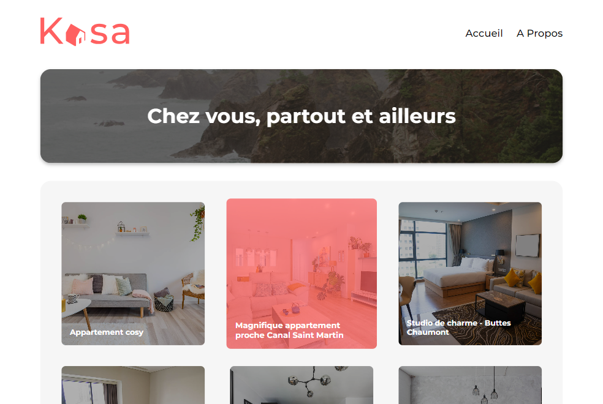
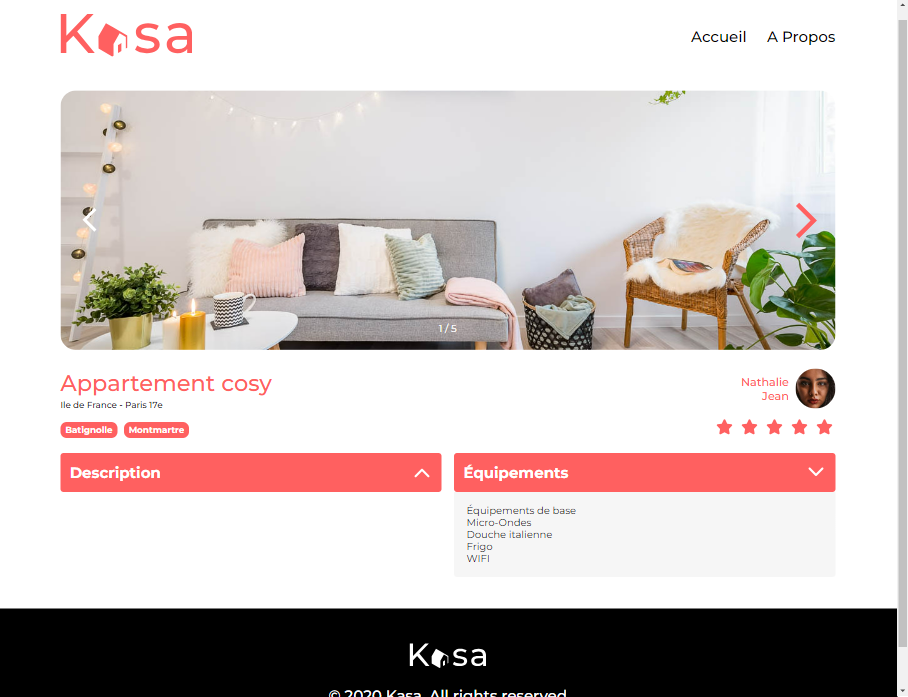
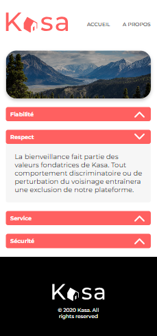
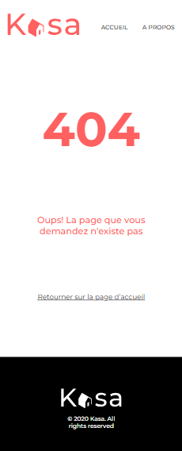

# Kasa Project

## Overview

Kasa Project is a front-end web application developed using SCSS and React. It was created as the fifth professionalizing school project within a training course leading to a diploma. The project was conducted in a business context with full autonomy, and its completion was validated by a jury.

## Objective

The main goal of the project is to build a user-friendly platform for apartment renting, showcasing various accommodations with detailed information and pictures.

## Features

- Gallery displaying all accommodations.
- Carousel for viewing multiple pictures of each accommodation.
- Detailed view of accommodation including host information and ratings.
- Dropdown buttons for accessing additional information such as equipment details and descriptions.
- Responsive design implemented based on the provided Figma mockup.

## Installation

To run the project locally, follow these steps:

1. Clone the repository to your local machine.
2. Navigate to the project directory.
3. Run `npm install`.
4. Run `npm start`.

## Data Source

Accommodation data is sourced from a JSON file located in the `src/assets/` directory. Each accommodation is represented as a JSON object containing various details, including pictures, host information, and ratings.
